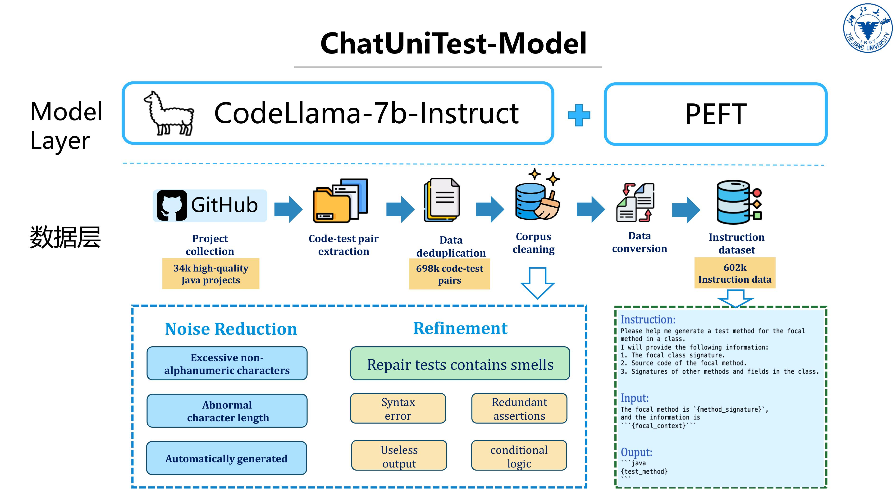

# ChatUniTest Models
Here we provide finetuned models for Java test generation tasks based on Code Llama.

## Models
|        Model        |     Base Model     |   parameters    |                                                  Model Weights                                                  |
|:---------------------------------------------------------------------:|:------------:|:-------------:|:-----------------------------------------------------------------------------------------------------------:|
|        codellama-testgen         |   CodeLlama   |   7B   |       [zzzghttt/CodeLlama-7b-Test-Instruct-lora](https://huggingface.co/zzzghttt/CodeLlama-7b-Test-Instruct-lora)          |
|        codellama-testgen2        |   CodeLlama   |   7B   |       [zzzghttt/TestGen2-lora](https://huggingface.co/zzzghttt/TestGen2-lora)          |

## Usage

1. Start the model server
```python
python model_server.py
```

2. Run a completion or generation route
```python
python chatunitest_completion_route.py
```

3. Then you can make requests by configure the url in ChatUniTest, see example request script in `completion_example.py`.

## Details

### Fine-Tuning Method

The fine-tuning process of codellama-testgen2.

